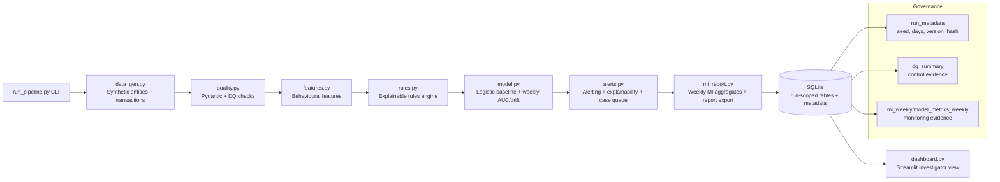

# Architecture

```mermaid
flowchart LR
    A[run_pipeline.py CLI] --> B[data_gen.py\nSynthetic entities + transactions]
    B --> C[quality.py\nPydantic + DQ checks]
    C --> D[features.py\nBehavioural features]
    D --> E[rules.py\nExplainable rules engine]
    E --> F[model.py\nLogistic baseline + weekly AUC/drift]
    F --> G[alerts.py\nAlerting + explainability + case queue]
    G --> H[mi_report.py\nWeekly MI aggregates + report export]
    H --> I[(SQLite\nrun-scoped tables + metadata)]
    I --> J[dashboard.py\nStreamlit investigator view]

    subgraph Governance
        K[run_metadata\nseed, days, version_hash]
        L[dq_summary\ncontrol evidence]
        M[mi_weekly/model_metrics_weekly\nmonitoring evidence]
    end

    I --> K
    I --> L
    I --> M
```
